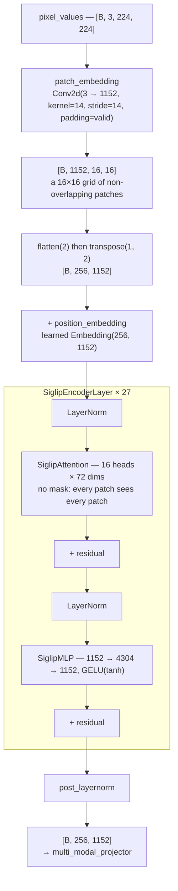
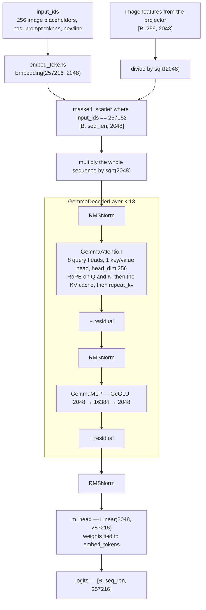

# PaliGemma, annotated — reading a VLM implementation line by line

PaliGemma (SigLIP vision encoder + linear projector + Gemma 2B) built from plain PyTorch,
with the real `google/paligemma-3b-pt-224` weights loaded into it. No `transformers`
modelling code is involved — only the tokenizer, the config and the checkpoint come from
the Hub, and the network itself is the code in this repository.

> This is a fork of [hkproj/pytorch-paligemma](https://github.com/hkproj/pytorch-paligemma)
> by Umar Jamil. **The model implementation is his.** What is mine is listed below and
> spelled out in [License and attribution](#license-and-attribution).

## Contents

- [What I added](#what-i-added)
- [What it actually outputs](#what-it-actually-outputs) — [Detection](#detection) · [Segmentation stops one step short](#segmentation-stops-one-step-short)
- [Usage](#usage)
- [How PaliGemma works](#how-paligemma-works)
  - [SigLIP](#siglip) · [SigLIP architecture](#siglip-architecture)
    <br/>[1 patches](#step1-divide-image-into-small-patches) · [2 embedding](#step2-embedding) · [3 position](#step3-positional-embedding) · [4 transformer block](#step4-transformer-block) · [5 output norm](#step5-output-norm)
  - [Projection](#projection)
  - [Gemma model](#gemma-model) · [Gemma architecture](#gemma-architecture)
    <br/>[1 input sequence](#step1-build-the-input-sequence) · [2 merge the image](#step2-embed-and-merge-the-image) · [3 scaling](#step3-scale-the-whole-sequence) · [4 decoder block](#step4-decoder-block) ([prefix-LM](#prefix-lm) · [prefill and decode](#prefill-and-decode) · [KV cache](#kv-cache)) · [5 tied head](#step5-final-norm-and-the-tied-head)
  - [SigLIP and Gemma side by side](#siglip-and-gemma-side-by-side)
  - [Vocabulary](#vocabulary) · [Where the parameters sit](#where-the-parameters-sit) · [Where the numbers come from](#where-the-numbers-come-from)
- [License and attribution](#license-and-attribution)

## What I added

| | |
|---|---|
| **`<loc>` detection decoder** — [detection.py](detection.py) | `detect cat` answers with `<loc0222><loc0113>…`; this parses those tokens back into pixel coordinates and draws the boxes. Not in upstream. |
| **Hugging Face weight loading** — [`resolve_model_path()`](utils.py) | Upstream required a manually downloaded checkpoint directory. Now `MODEL_PATH` also accepts a repo id and pulls only the files this implementation reads. |
| **Architecture write-up** — [below](#how-paligemma-works) | Follows one image and one prompt end to end — pixels into 256 SigLIP patch embeddings, through the projector, merged into the text sequence, then through Gemma's attention to a token — and says what each stage actually does to them. |
| **Line-by-line annotations** | Comments through `modeling_gemma.py`, `modeling_siglip.py`, `processing_paligemma.py`, `inference.py`. |
| **Inference runs** — [below](#what-it-actually-outputs) | All three of the task prefixes Google documents, run against the real weights, with the boxes drawn and the one limit this checkpoint cannot pass. |

## What it actually outputs

All runs use `google/paligemma-3b-pt-224` on the same photo
([test_images/pic1.jpeg](test_images/pic1.jpeg)), greedy decoding (`do_sample=False`),
`max_tokens_to_generate=100`, on Apple Silicon (`mps`). Greedy decoding makes these
reproducible — the script prints `prompt + decoded`, which is what the table shows.

These are the three task prefixes Google documents across the
[model card](https://huggingface.co/google/paligemma-3b-pt-224) and the
[big_vision README](https://github.com/google-research/big_vision/blob/main/big_vision/configs/proj/paligemma/README.md):
`caption {lang}`, `detect {things}`, `segment {things}`. There is no fourth — this is the
whole documented interface of a `pt` checkpoint.

| prompt | printed output |
|---|---|
| `caption en` | `caption en white and brown cat on the floor` |
| `detect cat` | `detect cat <loc0222><loc0113><loc0933><loc0824> cat` |
| `segment cat` | `segment cat <loc0205><loc0127><loc0889><loc0824> <seg087><seg041>…<seg055> cat` |


### Detection


`<loc0222><loc0113><loc0933><loc0824>` is `y_min, x_min, y_max, x_max` quantised to 1024
bins. Turning that into pixels is a plain linear rescale, and the reason is worth stating:
[`process_images`](processing_paligemma.py) squashes every input to a square with
`resize()`, which does **not** preserve the aspect ratio and adds no letterbox padding. So
bin 0 is always the top (or left) edge of the *original* image and bin 1023 the bottom (or
right) edge — no un-padding step is needed. [detection.py](detection.py) does the
conversion and the drawing.

### Segmentation stops one step short

`segment cat` answers in the same shape, with sixteen codewords inserted before the label:

```
<loc0205><loc0127><loc0889><loc0824> <seg087><seg041>…<seg055> cat
```

The box is recoverable — those are ordinary `<loc>` tokens, so [detection.py](detection.py)
draws them exactly as it draws a `detect` answer. The mask is not. Google describes the
`<seg>` entries as "codewords used by a lightweight referring-expression segmentation
**vector-quantized variational auto-encoder**", and that VQ-VAE decoder ships separately from
this checkpoint. So the asymmetry is real and worth stating plainly: `<loc>` is a **number**
and needs nothing to interpret it, while `<seg>` is an **index into a codebook this
repository does not have**. Same vocabulary, same softmax, one of them decodable here.

## Usage

```bash
pip install -r requirements.txt

# The PaliGemma weights are gated: accept the Gemma Terms of Use on the model
# page (https://huggingface.co/google/paligemma-3b-pt-224), then authenticate.
huggingface-cli login          # or: export HF_TOKEN=hf_...

./launch_inference.sh
```

`MODEL_PATH` in [launch_inference.sh](launch_inference.sh) accepts either a Hugging Face repo id
(`google/paligemma-3b-pt-224`, downloaded to `~/.cache/huggingface` on first run and reused
afterwards) or a path to a local directory that already contains the checkpoint. Only the
weights, `config.json` and the tokenizer are pulled from the Hub — the model itself is built
from the code in this repository.

`--output_file` is only meaningful for a `detect` prompt: the generated text is scanned for
`<loc>` tokens and, if any are found, the boxed image is written there.

# How PaliGemma works


<sub>Figure from *PaliGemma: A versatile 3B VLM for transfer*, Beyer et al., 2024 ([arXiv:2407.07726](https://arxiv.org/abs/2407.07726)).</sub>

PaliGemma is a vision language model which consists of a vision encoder (SigLIP), a projector, and an LLM (Gemma).

The key idea is : the image is turned into 256 vectors that live in the same space as word embeddings. From Gemma's point of view there is no "image", just a sequence of embeddings, some of which happen to have come from a picture.


## SigLIP
SigLIP is a vision encoder which takes an image and converts it into image tokens. The image is divided into small patches and each patch is converted into an embedding.

SigLIP improves on CLIP by replacing the **softmax-based contrastive loss with a pairwise sigmoid loss**. CLIP normalizes similarity scores across the entire batch, which requires gathering results from every device; SigLIP scores each image-text pair independently, so no global normalization is needed and training scales to much larger batches.

## SigLIP architecture

Every class in this diagram lives in [modeling_siglip.py](modeling_siglip.py).



### Step1 Divide image into small patches
A 224x224 image is cut into **14x14 pixel patches**, giving a **16x16 = 256 patch** grid — `(224 // 14) ** 2 = 256`, computed in `SiglipVisionEmbeddings`.

Patch extraction is a strided convolution, `Conv2d(kernel_size=14, stride=14, padding="valid")`. Because stride equals kernel size, the patches tile the image exactly and never overlap.

### Step2 embedding
The same convolution also does the embedding: `out_channels=1152` means each patch — 14 x 14 x 3 = 588 numbers — comes out as one 1152-dimensional vector. That is a plain linear projection of the flattened patch; the convolution is just an efficient way to apply the same projection to all 256 patches at once.

The result is then reshaped in two steps:

```
[B, 1152, 16, 16]  --flatten(2)-->  [B, 1152, 256]  --transpose(1,2)-->  [B, 256, 1152]
```

From here on the 2D layout is gone. The tensor is a **sequence of 256 vectors**, and nothing downstream knows which patch sat next to which.

### Step3 positional embedding
That lost geometry is restored by adding a **learned** table, `nn.Embedding(256, 1152)` — not the sinusoidal encodings of the original Transformer. Row *i* is simply added to patch *i*, and since patch *i* is always the same location in the grid, the model learns what it needs about spatial arrangement.

This table is also why resolution is baked into the weights rather than being a preprocessing choice. A 448x448 image would produce 1024 patches and index past the end of a 256-row table, which is why Google ships separate 224 / 448 / 896 checkpoints instead of one resolution-agnostic model.

### Step4 transformer block
`SiglipEncoderLayer`, repeated 27 times. It is **pre-norm**: the LayerNorm sits inside each residual branch, so the residual stream itself is never normalised.

```
h = h + Attention(LayerNorm(h))
h = h + MLP(LayerNorm(h))
```

Two details are visible only in the code:

- `SiglipAttention.forward` takes **no `attention_mask` argument**. There is nothing to mask — all 256 patches attend to all 256 patches, in every layer. Compare this with Gemma, where masking is the entire story.
- `SiglipMLP` is an ordinary two-layer feed-forward, 1152 → 4304 → 1152 with `gelu(approximate="tanh")` — not the gated GeGLU that Gemma uses.

### Step5 output norm
One final `post_layernorm` after all 27 layers, and the output is `[B, 256, 1152]`.

There is no CLS token, no pooling and no projection head, so 256 patches go in and 256 vectors come out — which is what lets PaliGemma hand Gemma a *sequence* to interleave with text rather than one image vector. The checkpoint agrees: `config.json` carries `"vision_use_head": false`. This implementation simply never builds a head, rather than reading that flag.

## Projection
SigLIP outputs 1152-dimensional vectors, but Gemma's hidden size is 2048. The projector is a single `nn.Linear(1152, 2048)` that resizes the **embedding dimension** so the image features can sit in the same space as text embeddings. The number of tokens (256) is unchanged.

It really is just the one matrix — no activation, no normalisation, no second layer. Worth noting because `config.json` declares `"projector_hidden_act": "gelu_fast"`, a key this implementation never reads.

## Gemma model
Gemma is the language model that consumes the merged sequence and generates text.

## Gemma architecture

Every class in this diagram lives in [modeling_gemma.py](modeling_gemma.py).



### Step1 build the input sequence
The processor builds one flat string and tokenizes it:

```python
f"{image_token * image_seq_len}{bos_token}{prefix_prompt}\n"
```

```
input_ids = [<image> x 256, <bos>, prompt tokens..., \n]
```

The `<image>` entries are pure **placeholders**. They reserve 256 slots in the sequence; their embeddings carry no visual information and are thrown away during the merge.

### Step2 embed and merge the image
`PaliGemmaForConditionalGeneration.forward` does this in three moves:

1. `get_input_embeddings()(input_ids)` — embed the whole sequence, including the meaningless `<image>` rows. This allocates a correctly shaped buffer.
2. `vision_tower` + `multi_modal_projector` — produce `[B, 256, 2048]` from the pixels.
3. `_merge_input_ids_with_image_features` — use `input_ids == image_token_index` as a mask and `masked_scatter` the image features into those 256 positions.

Text and image only become a single tensor at move 3, and they only actually *interact* one step later, inside the transformer's self-attention.

### Step3 scale the whole sequence
`GemmaModel.forward` opens by multiplying every embedding by `sqrt(hidden_size)`. This is why the image features were **divided** by the same constant just before being scattered in: the two cancel, so only the text embeddings are actually boosted and the image features arrive at their original scale.

It is a one-line detail with no comment upstream, and getting it backwards would leave the visual half of the sequence 45× too large.

### Step4 decoder block
`GemmaDecoderLayer`, repeated 18 times, pre-norm like SigLIP but different in every component:

- **`GemmaRMSNorm` instead of `LayerNorm`** — it rescales by the root mean square and never subtracts the mean. The learned gain is stored as `weight` initialised to zeros and applied as `(1.0 + weight)`, so an untrained norm is the identity.
- **RoPE instead of a position table.** SigLIP adds a learned position vector once, before the first layer. Gemma instead *rotates* Q and K inside **every** attention call, so position enters as a relative phase between query and key rather than as a value added to the residual stream.
- **GQA, taken to the limit.** 8 query heads share a **single** key/value head. `repeat_kv` broadcasts that one head back out to 8 just before the matmul, so the arithmetic is ordinary multi-head attention — the saving is entirely in what the KV cache has to store.
- **The mask is the whole story.** Where `SiglipAttention` has no mask argument at all, `GemmaAttention` asserts one is present.

Order matters in the attention body: RoPE is applied **before** the KV cache is updated, so the cache holds already-rotated keys and each key keeps the position it had when it was written. `repeat_kv` comes after, so the cache stores one head rather than eight.

#### Prefix-LM


<sub>Figure from *PaliGemma: A versatile 3B VLM for transfer*, Beyer et al., 2024 ([arXiv:2407.07726](https://arxiv.org/abs/2407.07726)). The solid block covering the image and prefix is the bidirectional part; only the lower-right triangle over the suffix is causal.</sub>

Google's own wording matches the code's naming:

> The image tokens and prefix tokens are concatenated (in this order) and passed to the Gemma decoder with **full block-attention**, which then generates an output text (the "suffix") auto-regressively with **masked attention**.

PaliGemma is a **prefix-LM**, not a plain causal LM. The image tokens and the prompt form a prefix that attends **bidirectionally** — every image patch can see every other patch and the prompt, and vice versa. Only the generated suffix is causally masked. In this repo the prefill mask is filled with zeros (no masking at all), which implements exactly that, and assumes no padding.

#### Prefill and decode

Generation runs the same `forward` in two different regimes. `_merge_input_ids_with_image_features` branches on whether the cache is empty, and every shape downstream follows from that:

| | prefill | decode |
|---|---|---|
| `input_ids` | 256 image slots + `<bos>` + prompt + newline | the single token just generated |
| `q_len` | the whole sequence | 1, asserted |
| mask | `[B, 1, q_len, q_len]` | `[B, 1, 1, kv_len]` |
| `position_ids` | `1 … q_len`, from `cumsum` over the attention mask | only the newest position |
| attention weights | a full `q_len × q_len` matrix per head | **one row**, `1 × kv_len` |
| KV cache | written — every position, every layer | one position appended per layer |

Prefill is the expensive pass: every token attends to every token, so the attention matrix is quadratic and the cache is filled in one shot. Decode never rebuilds it. The query is a single token, the keys and values come back from the cache, and each step computes exactly one row of attention against everything seen so far. That is the whole payoff — without the cache, step *t* would recompute all *t* keys and values from scratch.

This is why [inference.py](inference.py) appends only `next_token` to `input_ids` after the first iteration, instead of resubmitting the growing sequence.

#### KV cache

`KVCache` is deliberately plain: **every layer keeps its own** key tensor and value tensor, held in a list indexed by `layer_idx`, and `update()` does nothing but `torch.cat` along the sequence dimension and return everything accumulated so far. Prefill fills the cache in a single pass. Each decode step then projects a key and a value for the one incoming token, appends them, and computes attention against the whole accumulated set. Every layer has its own KV cache. KV cache will be built in Prefill phase, in decoder phase, it create a new KV and append to existing KV cache then calculate attention score.

#### One KV head shared by eight query heads

In ordinary multi-head attention, each of the 8 heads gets its own Q, **its own K and its own V**.

The problem is the cache. Every decode step reads the whole KV cache back — 100 times over a 100-token answer — and eight separate key/value heads would be 8× more to read each time. **Reading is the slow part**, not the arithmetic.

So Gemma computes only **one** key head and one value head, and all 8 query heads attend over that same shared pair. `repeat_kv` copies it out to eight just before the matmul, so the attention itself stays ordinary 8-head attention — the saving is entirely in what the cache had to hold.

### Step5 final norm and the tied head
One last `RMSNorm`, then `lm_head` projects 2048 back to the full 257216-entry vocabulary. `tie_weights()` points `lm_head.weight` at `embed_tokens.weight`, so the same matrix reads the input and scores the output.

### SigLIP and Gemma side by side

The two towers share a shape and almost nothing else:

| | SigLIP | Gemma |
|---|---|---|
| depth × width | 27 × 1152 | 18 × 2048 |
| normalisation | `LayerNorm` | `RMSNorm`, no mean subtraction |
| position | learned table, added once | RoPE, applied every layer to Q and K |
| feed-forward | plain 2-layer, GELU | GeGLU, gated |
| attention mask | none — the argument does not exist | required; prefix bidirectional, suffix causal |
| KV heads | same as query heads | one, shared by all 8 |

### Vocabulary
PaliGemma extends the Gemma tokenizer so that detection and segmentation can be expressed as plain text generation:

| ID | tokens | count |
|---|---|---|
| 0 - 255999 | original Gemma vocabulary | 256000 |
| 256000 - 257023 | `<loc0000>` - `<loc1023>` | 1024 |
| 257024 - 257151 | `<seg000>` - `<seg127>` | 128 |
| **257152** | **`<image>`** | 1 |
| 257153 - 257215 | unused padding | 63 |
| | **vocab_size** | **257216** |

The `<loc>` tokens let the model answer "detect cat" by emitting `<loc0512><loc0256>...cat`, i.e. bounding boxes come out of the same softmax as words — [the detection run above](#detection) is this table in action. The trailing padding rounds the embedding matrix to a multiple of 64 for hardware efficiency.

Because these tokens are registered with `tokenizer.add_tokens()` rather than as *special* tokens, `decode(..., skip_special_tokens=True)` leaves them in the output — which is why `detect` results are readable at all without changing the decoding call.

The embedding table is **tied** between input and output (`embed_tokens` and `lm_head` share weights), so those 257216 x 2048 ≈ 527M parameters are only stored once.

### Where the parameters sit
`GemmaMLP` is three matrices of `2048 x 16384`, so each layer's feed-forward is roughly 100M parameters against a much smaller attention block — `num_key_value_heads: 1` shrinks two of the four attention projections to a single head. Across 18 layers the MLPs therefore hold most of Gemma's weights, with the 527M tied embedding table the other large share.

### Where the numbers come from

Every shape quoted above is from the checkpoint's `config.json`, not from the class signatures. `utils.py` builds the config with `PaliGemmaConfig(**model_config_file)`, so any key present in the file overwrites its default — and several defaults are simply wrong for this checkpoint:

| | class default | config.json |
|---|---|---|
| `image_token_index` | 256000 | **257152** |
| `vocab_size` | 257152 | **257216** |
| `patch_size` | 16 | **14** |
| vision `hidden_size` | 768 | **1152** |
| vision `num_hidden_layers` | 12 | **27** |
| vision `intermediate_size` | 3072 | **4304** |

Instantiating `SiglipVisionConfig()` with no arguments therefore gives you a *different model* — 12 layers of width 768 over 16-pixel patches — that will happily load nothing and fail in confusing ways.

The more interesting direction is the opposite one. Some values the model depends on are **absent** from `config.json`, so there the class defaults are load-bearing rather than wrong:

- **`image_size`** is not in `vision_config`. The 224 comes from `SiglipVisionConfig.__init__`, and it is what sizes the 256-row position table.
- **`head_dim`** is not in `text_config`. The 256 comes from `GemmaConfig.__init__`. It happens to equal `hidden_size // num_attention_heads` here, but nothing in the code derives it that way.
- **`rope_theta`**, **`rms_norm_eps`** and **`max_position_embeddings`** are absent too, so RoPE's base of 10000 is a default, never a stated fact about this checkpoint.

So "read `config.json`, not the defaults" is only half the rule. The file is a *partial* override, and knowing which half you are standing on requires reading both.

## License and attribution

This repository is a **derivative work**, and the parts have different owners.

| | Origin | Terms |
|---|---|---|
| `inference.py`, `modeling_gemma.py`, `modeling_siglip.py`, `processing_paligemma.py`, `utils.py`, `launch_inference.sh`, `notes/` | [hkproj/pytorch-paligemma](https://github.com/hkproj/pytorch-paligemma) by Umar Jamil | **No license published upstream** — all rights reserved by the original authors. Reproduced here for study only. |
| `detection.py`, `resolve_model_path()` in `utils.py`, this README and the explanatory code comments | Mine | MIT — see [LICENSE](LICENSE) |
| PaliGemma weights | Google | [Gemma Terms of Use](https://ai.google.dev/gemma/terms). Not included here; download separately. |

Because the upstream repository carries no license, the base implementation is
technically "all rights reserved" and this repository cannot grant you any
rights to it. If you want to build on the model code itself, ask upstream to
add a license first.

The [LICENSE](LICENSE) file states this scope explicitly and covers only my own
contributions.
